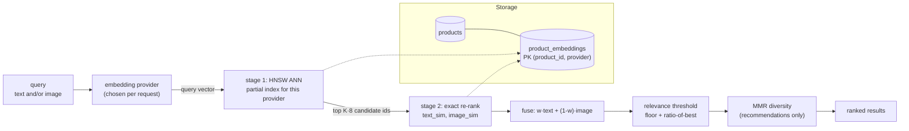
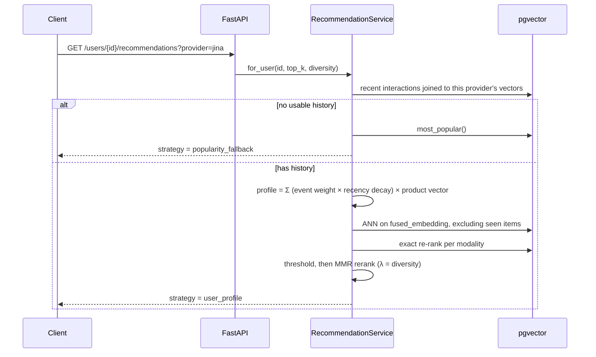

# Multimodal Product Recommender

A FastAPI product search and recommendation service where **text and product photos live in
the same vector space**. Search with a sentence, with an image, or with both blended together;
get personalised recommendations from user behaviour — all backed by PostgreSQL + `pgvector`.

Several embedding providers can be **indexed side by side** and compared on the same query, and
nothing is ever downloaded or run locally: embeddings come from a hosted API (Jina v4, Cohere
embed-v4) or from a built-in offline stand-in that needs no API key at all.

---

## The core idea

Every product carries **three vectors, per provider**, in `product_embeddings`:

| Column | Built from | Purpose |
|---|---|---|
| `text_embedding` | name + category + brand + description + attributes | semantic text matching |
| `image_embedding` | the product photo (`NULL` if it has none) | visual matching |
| `fused_embedding` | `normalize(w·text + (1-w)·image)` | the column the ANN index rides on |

Queries take the same shape, and retrieval happens in two stages:

1. **ANN** over `fused_embedding` (partial HNSW, cosine, one index per provider) pulls a cheap
   candidate pool.
2. **Exact re-rank** recomputes similarity against `text_embedding` and `image_embedding`
   separately, then fuses them using *the caller's own* `text_weight`, and finally applies a
   relevance threshold.

Keeping the components alongside the fusion is what makes the weight a runtime knob instead of
an index-build decision. One index serves every weighting.



### Why a table, not more columns

Vectors live in `product_embeddings`, keyed by `(product_id, provider)`. Re-indexing with Jina
leaves the `local_hash` and `cohere` rows untouched, so you can run the same query against each
index and compare. Extra columns would have meant a migration per provider and no clean way to
scope a query to one vector space.

All providers are pinned to the same `EMBEDDING_DIM` (512 suits every one currently shipped),
which is what lets one column type and one index definition serve them all. Each provider still
gets its **own partial HNSW index** — a single shared index would merge unrelated vector spaces
into one graph and wreck recall.

That shared width is the main constraint when adding a provider. Matryoshka-trained models
(Jina, Cohere, Gemini, Voyage 3.5, OpenAI, Nomic) truncate cleanly to 512. **Fixed-dimension
models cannot**: `mistral-embed` is 1024-only and most open text encoders are 768 or 1024. One
such model is fine — raise `EMBEDDING_DIM` to its size and re-index, since the truncatable ones
can emit that width too. Two fixed models at *different* widths cannot coexist without a schema
change (a second column, or a table per width).

**Adding a provider always needs a migration**, because `ALL_PROVIDERS` drives the partial
indexes. Without one, queries still work — just via a sequential scan instead of HNSW.

---

## Stack & ports

| Piece | Choice | Port |
|---|---|---|
| API | FastAPI + Uvicorn, Pydantic v2 | **8800** |
| Database | PostgreSQL 17 + `pgvector` (HNSW, cosine) | **5439** |
| ORM / migrations | SQLAlchemy 2 (async, psycopg 3) + Alembic | — |
| Embeddings | Jina v4 / Cohere embed-v4 / offline stand-in | — |
| Demo UI + admin panel | single static page served by the API | `/` |

Ports are deliberately non-default so this stack coexists with other local Compose projects.

---

## Running it

```bash
docker compose up -d
```

```bash
uv venv && uv pip install -e ".[dev]"
```

```bash
cp .env.example .env && uv run alembic upgrade head
```

```bash
uv run uvicorn app.main:app --reload --port 8800
```

Then open <http://localhost:8800>, go to the **Admin** tab, and click **Seed catalogue** — no
terminal needed. The CLI equivalents still exist:

```bash
uv run python -m scripts.seed --reset -p local_hash -p jina
```

```bash
uv run recsys info          # config + per-provider index coverage
uv run recsys reindex -p jina
```

The seeder loads 28 products across 8 categories and draws their images procedurally with
Pillow, so it works offline. To use real photos, drop files named after the SKU (`SNK-001.jpg`,
…) into `data/images/seed/` before seeding — **strongly recommended if you care about the
image side**, see the honest assessment below.

---

## Choosing an embedding provider

Set `EMBEDDING_PROVIDER` for the default, and add whichever API keys you have. Every configured
provider can be indexed and searched; the default only decides what a request gets when it
names no provider.

| Provider | Images? | Cross-modal? | Cost | Notes |
|---|---|---|---|---|
| `local_hash` | Yes | **No** | free, offline | Feature-hashed text + colour/edge image histograms. No API key, no model download. |
| `jina` | Yes | **Yes** | free tier | `jina-embeddings-v4`, 1–2048 dims via Matryoshka truncation. |
| `cohere` | Yes | **Yes** | trial tier | `embed-v4.0`, dims 256/512/1024/1536. |
| `voyage` | Yes | **Yes** | 200M tokens on signup (**one-time**, not recurring) | `voyage-multimodal-3.5`, dims 256/512/1024/2048. |
| `gemini` | **No** | No | most generous recurring free tier | `gemini-embedding-001` is **text-only**; only `gemini-embedding-2` is multimodal. |

Three things worth knowing before you enable one:

- **`gemini` is text-only.** Products carry no image vector on that index and image search
  against it is refused, not faked. Text search works normally, and its free tier is the most
  generous of the lot — a good "best free text quality" baseline to compare against.
- **`voyage-multimodal-3` (not 3.5) is fixed at 1024 dims** with no truncation. Selecting it
  means running the whole stack at `EMBEDDING_DIM=1024` and re-indexing everything. The
  `output_dimension` parameter is undocumented for the multimodal endpoint, so it is only sent
  for 3.5 — and if the service ignores it, the base class turns the mismatch into a loud error
  rather than a corrupt index.
- **`gemini` truncated output is not unit-length.** Google only normalises at the native 3072
  dims, so the client re-normalises anything smaller. Skipping that would make every cosine
  comparison silently wrong.

The per-provider score floors for `gemini` and `voyage` default to `0` (disabled) because,
unlike Jina and Cohere, they have not been measured against this catalogue. Measure before
trusting a number there.

### What "cross-modal" actually means here

Only a real multimodal model puts a sentence and a photograph in the *same* space. That is what
lets "a red running shoe" match a **picture** of one with no shared keywords.

`local_hash` does **not** do that, and the system never pretends otherwise:
`supports_cross_modal` is surfaced in every search response, in `/health/ready`, in the startup
log, and as a banner in the UI. Text queries are compared only against `text_embedding` and
image queries only against `image_embedding`, because mixing them would pour unrelated noise
into the candidate pool.

### Measured quality difference

Same query, same catalogue, three indexes — `"something to keep me dry in a storm"`, a phrase
sharing no words with any product description:

| Index | Top 3 |
|---|---|
| `local_hash` | Neon Street Trainer, Court Classic Sneaker, Industrial Task Lamp |
| `cohere` | Harbour Rain Shell, Alpine Down Puffer, Featherlight Windbreaker |
| `jina` | Featherlight Windbreaker, Harbour Rain Shell, Alpine Down Puffer |

That gap *is* the difference between lexical overlap and semantics. Tick **compare all indexes**
in the UI to reproduce it.

---

## Surviving a rate-limited free tier

Voyage without a payment method allows **3 requests/min and 10K tokens/min**. Three things make
a re-index viable at that budget, and they matter in this order:

**1. Batch — this is the big one.** Re-indexing embeds a *batch* of products per request, not
one product at a time. The naive version issued two requests per product (56 for a 28-product
catalogue, ~20 minutes at 3 RPM); batching brings that to single figures.

**2. Cap image batches per provider.** Images are billed by pixel and dwarf text. Measured
against Voyage's free tier:

| request | usage | result |
|---|---|---|
| 16 product texts | 577 tokens | OK |
| 1 image | 468 tokens | OK |
| 4 images | 1,872 tokens | OK |
| 8 images | — | **429** |

So `PROVIDER_IMAGE_BATCH` caps Voyage at 4 images per request. This — not the pacing — was what
actually broke the first attempts.

**3. Pace client-side, and back off by the pacing interval.** `PROVIDER_RPM` spaces requests
before sending them, which turns a guaranteed 429 into a wait. Voyage is deliberately set to
**2 RPM rather than its stated 3**: pacing exactly at the limit still trips, and each rejected
attempt costs another interval. When a 429 carries `Retry-After` it is honoured; when it does
not, the backoff floor is one full pacing interval, because 2s/4s/8s all land inside the same
one-minute window and achieve nothing.

Two more properties make failure cheap rather than catastrophic:

- **Each batch commits on its own.** A rate limit at product 20 keeps the first 19 instead of
  rolling everything back.
- **Re-index supports resume** (`skip_existing`, or the "resume" checkbox in the Admin tab), so
  a retry only pays for what is missing.

Raise `PROVIDER_RPM` and `PROVIDER_IMAGE_BATCH` once you add billing — these defaults are tuned
for the free tier, and are pessimistic for a paid one.

## Relevance thresholds

Vector search always returns *something* — the nearest neighbours exist however unrelated they
are. Two independent cutoffs stop that filling the page with junk:

- **`min_score_ratio`** (default `0.45`) keeps only hits within a fraction of the *best* hit.
  Scale-free, so it transfers between providers.
- **`min_score`** is an absolute floor. Defaults are **calibrated per provider** in
  `app/core/config.py`, because the ratio alone is not enough: measured on this catalogue Jina
  puts a strong match at ~0.60 and an unrelated product at ~0.50 — a band so tight the ratio
  never fires — while Cohere spreads 0.34 down to 0.15.

With both in place, a nonsense query returns **nothing** on either hosted provider rather than
five confident-looking wrong answers:

```text
query: "zzzz qqqq nonexistent gibberish"
  jina    floor=0.50 · 28 cut · 0 kept   (nothing above threshold)
  cohere  floor=0.18 · 28 cut · 0 kept   (nothing above threshold)
```

The per-provider floors are starting points measured on *this* catalogue, not laws — re-measure
against yours. Set a provider's floor to `0` to disable it, or pass `min_score` per request.

---

## API

| Method | Path | What it does |
|---|---|---|
| `POST` | `/api/v1/products` | Create a product (multipart, optional photo) and embed it |
| `GET` | `/api/v1/products` | List with category/brand/price filters |
| `GET` | `/api/v1/products/{id}` | Fetch one |
| `PUT` | `/api/v1/products/{id}/image` | Attach/replace a photo, re-embed for every index |
| `DELETE` | `/api/v1/products/{id}` | Remove product, vectors and image |
| `POST` | `/api/v1/search/text` | Semantic text search |
| `POST` | `/api/v1/search/image` | Reverse image search |
| `POST` | `/api/v1/search/multimodal` | Text + image blended by `text_weight` |
| `GET` | `/api/v1/products/{id}/similar` | "More like this" |
| `POST` | `/api/v1/interactions` | Record view/click/like/cart/purchase |
| `GET` | `/api/v1/users/{id}/recommendations` | Personalised feed |
| `GET` | `/api/v1/admin/status` | Catalogue size, per-provider coverage, job history |
| `POST` | `/api/v1/admin/seed` | Seed the demo catalogue (background job) |
| `POST` | `/api/v1/admin/reindex` | Rebuild chosen indexes (background job) |
| `POST` | `/api/v1/admin/clear-provider` | Drop one index, keep products and other indexes |
| `POST` | `/api/v1/admin/clear-catalog` | Delete everything |
| `GET` | `/api/v1/admin/jobs/{id}` | Poll a background job |
| `GET` | `/health`, `/health/ready` | Liveness; readiness incl. pgvector + index coverage |

Every search and recommendation endpoint takes an optional `provider`. Naming one that has no
credentials is a **422, not a silent fallback** — a fallback would make an A/B quietly
meaningless.

```bash
curl -s localhost:8800/api/v1/search/text -H 'content-type: application/json' \
  -d '{"query":"something to keep me dry in a storm","provider":"jina","top_k":5}'
```

```bash
curl -s -F image=@photo.jpg "localhost:8800/api/v1/search/image?provider=cohere&top_k=5"
```

```bash
curl -s -F image=@shoe.jpg -F query="but in red" \
  "localhost:8800/api/v1/search/multimodal?provider=jina&text_weight=0.35"
```

### The `text_weight` knob

`score = w · text_similarity + (1 − w) · image_similarity`. It is "how much should the wording
matter versus how the product looks". Same seed product, three weightings (seed = *Alpine Down
Puffer Jacket*, `local_hash` index):

| `text_weight` | Top results |
|---|---|
| `1.0` (text only) | Heritage Waxed Cotton Jacket, Featherlight Windbreaker, Harbour Rain Shell |
| `0.6` (default) | Commuter Laptop Backpack, Heritage Waxed Cotton Jacket, Pulse Smart Watch |
| `0.0` (image only) | Mesh Ergonomic Desk Chair, Pulse Smart Watch, Commuter Laptop Backpack |

At `0.0` everything returned is *midnight*-coloured — visual similarity, exactly as asked.

---

## How recommendations work

Both paths end in the same retrieve → re-rank → threshold → diversify pipeline; only the query
vector differs.



- **Event weights** — purchase 4.0, cart 3.0, like 2.0, click 1.0, view 0.5.
- **Recency decay** — exponential, 14-day half-life. A fresh view can outweigh a stale purchase.
- **Already-seen items are excluded.**
- **MMR diversity** (`diversity` = λ): `λ·relevance − (1−λ)·max similarity to already-picked`.
  Thresholding happens *before* MMR, so diversity chooses between plausible items rather than
  faithfully spreading junk across the page.
- **Cold start** falls back to popularity and says so in `strategy`.

---

## Layout

```text
app/
├── api/v1/       # HTTP only: parse, call a service, serialise
├── core/         # config, logging, db session, domain errors
├── embeddings/   # provider interface + jina / cohere / local_hash + registry
├── models/       # SQLAlchemy: products, product_embeddings, interactions
├── repositories/ # data access — all vector SQL lives here
├── schemas/      # Pydantic request/response
├── seeding/      # demo catalogue, procedural images, seeding routine
└── services/     # the rules: catalog, search, recommendation, ranking, admin, jobs
migrations/       # Alembic; vector width comes from EMBEDDING_DIM
static/           # single-page demo UI + admin panel
tests/            # unit (pure) + integration (real Postgres, rolled back)
```

Layering is one-directional: `api → services → repositories → db`.

`app/seeding/` lives inside the package (not in `scripts/`) so the admin API can drive it. In a
real deployment you would strip it out along with the admin endpoints.

---

## Development

```bash
uv run pytest -q
```

```bash
uv run ruff format . && uv run ruff check --fix . && uv run mypy app
```

Unit tests are pure and fast — ranking maths, the offline provider, and the hosted clients
driven through a mock transport so a wrong API field name fails locally rather than against a
real quota. Integration tests run against a dedicated `recsys_test` database (created
automatically), each inside a transaction that is rolled back. A session-wide fixture blanks any
real API keys, so **no test can ever spend your quota**.

---

## Honest assessment of the image side

The cross-modal *machinery* is verified working against the live Jina and Cohere APIs. The
cross-modal *results* on the demo data are weak, and it is worth being clear why.

The seeded product images are procedurally drawn polygons, not photographs. Models trained on
real photos do not recognise a crude vector shape as a jacket, so the image vectors carry very
little semantic signal — scores bunch up (Cohere returned 0.199 / 0.174 / 0.174 / 0.174 for a
text→image query, i.e. nearly no discrimination). The text side is genuinely good; the image
side is limited by the demo imagery, not by the retrieval code.

**Put real product photos in `data/images/seed/` and re-index** to see what cross-modal search
actually does. Everything else — the two-stage retrieval, per-provider indexes, weighting,
thresholds — behaves the same either way.

---

## Gotchas worth knowing

- **`EMBEDDING_DIM` is baked into the schema.** `pgvector` columns are fixed width and the
  migration reads the setting at run time. Changing it means `alembic downgrade base`,
  `upgrade head`, and a re-index.
- **Migration 0002 attributes pre-existing vectors to whatever `EMBEDDING_PROVIDER` said at
  migration time.** If you changed that setting between running 0001 and 0002, the carried-over
  vectors are mislabelled — re-index the affected provider. (This bit during development.)
- **Vectors from different providers are never comparable.** Every query is scoped by provider;
  that predicate is not optional.
- **`event` is a reserved key in structlog.** `log.info("...", event=x)` raises `TypeError: got
  multiple values for argument 'event'`. Use `event_type`.
- **Don't name a repository method `list`.** Inside the class body it shadows the builtin, so a
  later `-> list[uuid.UUID]` annotation dies with `'function' object is not subscriptable`.
- **Products without a photo are scored on text alone**, not penalised toward zero — otherwise
  items awaiting photography could never rank.
- **Image features are mean-centred on purpose.** Raw per-cell colour means put every catalogue
  image above 0.94 cosine of every other, because product shots are mostly identical backdrop.
  There is a regression test pinning this.
- **Admin jobs open their own sessions and commit**, so they escape the request transaction —
  which is exactly why the tests use a separate database.
- **The job registry is in-memory.** Jobs do not survive a restart and it does not work across
  replicas; a real deployment would use a task queue.
