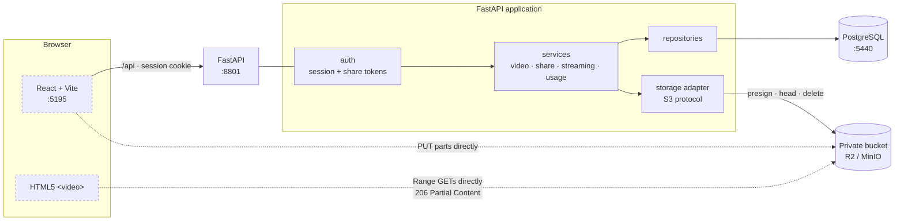
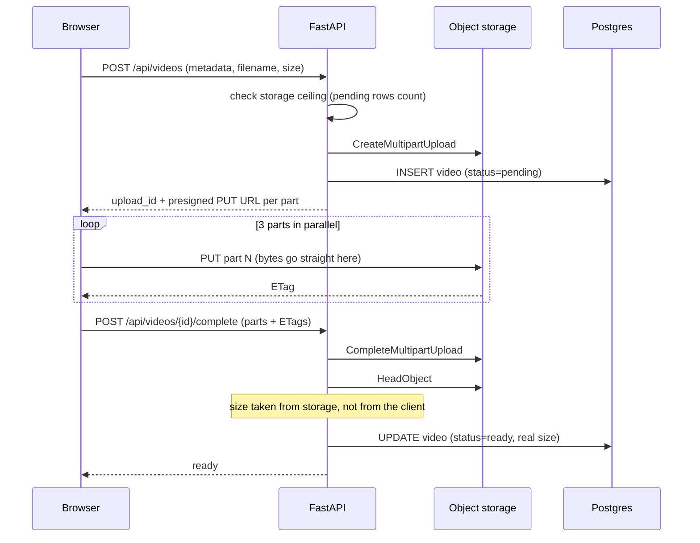
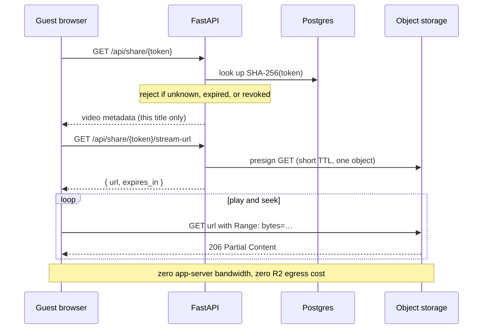

# Personal Media Server

A self-hosted, single-owner media server. The owner uploads their own video files to private
object storage, browses them in a web library, and streams them in-browser — including to a friend
on a different ISP — with instant start and working seek, **without the app server ever touching
the video bytes**.

Built from [`personal-media-server-prd.md`](personal-media-server-prd.md) (Phases 1 and 2).

> **Content constraint:** the only way media enters this system is the authenticated owner upload
> flow. There is no ingest path that pulls from external sources, no scraping, and no proxying of
> third-party sites.

---

## Stack

| Layer | Choice |
|---|---|
| API | Python 3.12, FastAPI, Uvicorn, Pydantic v2 |
| Data | PostgreSQL 17, SQLAlchemy 2, Alembic |
| Storage | S3-compatible — **Cloudflare R2** in production, **MinIO** for local dev |
| Auth | Argon2 password hashing, JWT in an httpOnly cookie |
| Frontend | React 18 + TypeScript + Vite + Tailwind |
| Tooling | uv, Ruff, mypy (strict), pytest |

### Ports

| Service | Port | Notes |
|---|---|---|
| Frontend (Vite) | `5195` | Proxies `/api` → the backend |
| Backend (FastAPI) | `8801` | OpenAPI docs at `/docs` |
| PostgreSQL | `5440` | Non-default, so it coexists with other local stacks |
| MinIO S3 API | `9010` | |
| MinIO console | `9011` | `minioadmin` / `minioadmin` |

---

## Architecture



The dotted lines are the point of the design: **video bytes never transit the app server**, in
either direction. The server issues short-lived presigned URLs and stays out of the byte path.

### Upload — direct to storage



### Playback — presigned redirect (PRD §9, Option B)



A presigned URL can expire during a long title, so the player catches the media error, requests a
fresh URL, and resumes at the same timestamp.

---

## Running it

**Prerequisites:** Docker, [uv](https://docs.astral.sh/uv/), Node 20+.

```bash
docker compose up -d
```

```bash
cp .env.example backend/.env
```

Then set a real `JWT_SECRET` in `backend/.env`:

```bash
python3 -c "import secrets; print(secrets.token_urlsafe(48))"
```

```bash
cd backend && uv venv --python 3.12 && uv pip install -e ".[dev]"
```

```bash
cd backend && uv run alembic upgrade head
```

Create the owner account (there is no self-service registration):

```bash
cd backend && uv run media-cli seed-owner --username <you>
```

Run the two dev servers:

```bash
cd backend && uv run uvicorn app.main:app --reload --port 8801
```

```bash
cd frontend && npm install && npm run dev
```

Open http://localhost:5195.

### Everyday commands

```bash
make help
```

---

## Switching to Cloudflare R2

No code changes — swap the storage block in `backend/.env`:

```bash
STORAGE_BACKEND=r2
S3_BUCKET=media
S3_ENDPOINT_URL=https://<ACCOUNT_ID>.r2.cloudflarestorage.com
S3_ACCESS_KEY_ID=<key>
S3_SECRET_ACCESS_KEY=<secret>
S3_REGION=auto
```

Then, in the Cloudflare dashboard:

1. Keep the bucket **private** — no public access, no listing (NFR-2.1).
2. Add a **CORS policy** allowing `PUT`, `GET`, `HEAD` from your app's origin, exposing the `ETag`
   header. Browser uploads and range reads both go directly to R2, so without this they fail with
   an opaque CORS error. (R2 rejects the S3 `PutBucketCors` call, so the app cannot set this for
   you — it logs a warning and continues.)
3. Set `PUBLIC_BASE_URL` to the public URL of the frontend so share links are correct.

Verify connectivity before trusting it:

```bash
cd backend && uv run media-cli storage-check
```

---

## API

Everything is under `/api`. Auth is the owner session cookie unless noted.

| Method | Path | Auth | Purpose |
|---|---|---|---|
| POST | `/api/auth/login` | none | Owner login → session cookie |
| POST | `/api/auth/logout` | owner | End session |
| GET | `/api/auth/me` | owner | Current user |
| POST | `/api/videos` | owner | Create metadata (pending) + init multipart upload |
| POST | `/api/videos/{id}/complete` | owner | Complete upload → ready |
| POST | `/api/videos/{id}/abort` | owner | Discard a pending upload |
| GET | `/api/videos` | owner | Library (filters: `genre`, `year`, `q`, `page`, `page_size`) |
| GET | `/api/videos/facets` | owner | Genre and year values for the filter controls |
| GET | `/api/videos/{id}` | owner **or** share token | Video detail |
| PATCH | `/api/videos/{id}` | owner | Edit metadata |
| DELETE | `/api/videos/{id}` | owner | Delete video + objects |
| GET | `/api/videos/{id}/poster` | owner **or** share token | 302 → presigned poster URL |
| GET | `/api/videos/{id}/stream-url` | owner **or** share token | `{ url, expires_in, size_bytes }` |
| GET | `/api/videos/{id}/stream` | owner **or** share token | 302 → presigned URL, or `?mode=proxy` for byte ranges |
| POST | `/api/videos/{id}/share` | owner | Create a share link (token returned **once**) |
| GET | `/api/videos/{id}/share` | owner | Links for one video |
| GET | `/api/share/{token}` | none | Guest playback metadata for one title |
| GET | `/api/share/{token}/stream-url` | none | Guest stream URL |
| DELETE | `/api/share/{token}` | owner | Revoke by raw token |
| GET | `/api/share-links` | owner | All links |
| DELETE | `/api/share-links/{id}` | owner | Revoke by id (what the UI uses) |
| GET | `/api/usage` | owner | Storage used, counts, limits |
| GET | `/health` | none | Liveness |

Errors use one envelope: `{"error": {"code": "...", "message": "..."}}`.

A share token may be presented as `?token=…` or the `X-Share-Token` header, and grants access to
**exactly** the one video it was issued for.

---

## Layout

```text
backend/app/
├── api/          # HTTP layer only: parse, call a service, serialize
├── core/         # config, db, logging, security, errors, rate limiting
├── models/       # SQLAlchemy, one module per domain
├── schemas/      # Pydantic, one module per domain
├── services/     # all business rules live here
├── repositories/ # data access
├── storage/      # StorageBackend protocol + the S3 implementation
└── utils/        # range parsing
frontend/src/
├── api.ts        # the only place that talks to the backend
├── upload.ts     # direct-to-storage multipart upload
├── components/   # Player, VideoCard, ShareDialog, Layout
├── pages/        # Login, Library, Upload, Video, Share (guest), Usage
└── store/        # zustand session store
```

Layering is one-directional: `api → services → repositories → db`.

---

## Conventions & gotchas

Things learned the hard way here — do not regress them.

- **The API is mounted under `/api`.** The PRD lists paths without a prefix, but the SPA has a
  `/usage` page and the API has a `/usage` endpoint; on one origin they collide and a page refresh
  returns raw JSON. Sub-paths are otherwise exactly as specified in PRD §12.
- **Share tokens are stored as SHA-256 hashes** (`share_links.token_hash`), a deliberate deviation
  from PRD §8. The raw token is returned exactly once, at creation. A database leak yields no
  working links.
- **Never set `Content-Type` on a presigned part PUT.** It is not part of the signature, and
  sending one makes S3/R2 reject the request as a signature mismatch.
- **`ETag` must be CORS-exposed** by the bucket, or `complete_multipart_upload` gets empty ETags
  and fails. MinIO exposes it by default; R2 needs it in the dashboard CORS rule.
- **slowapi's `headers_enabled` must stay `False`.** With it on, every rate-limited endpoint must
  accept or return a starlette `Response`, and any endpoint returning a Pydantic model 500s with
  "parameter `response` must be an instance of starlette.responses.Response".
- **`MINIO_SERVER_URL` must match the host the browser uses.** Presigned URLs are signed for a
  specific host; if MinIO signs for its container name, the browser gets a signature mismatch.
  The same applies to R2 behind a private network — that is what `S3_PUBLIC_ENDPOINT_URL` is for.
- **Pending uploads count against the storage ceiling.** Otherwise several concurrent uploads can
  collectively blow past the budget. Aborting or deleting frees the reservation.
- **Object size comes from `HeadObject` after completion**, never from the client's claim — the
  budget must not be spoofable.
- **`cors_origins` is read as a raw comma-separated string.** pydantic-settings insists on JSON
  for a `list[str]` field read from `.env`, which is a miserable thing to have in a config file.
- **Genre filtering uses `@>` (array containment)**, not `= ANY`, so the GIN index on
  `videos.genres` is actually used.
- **Non-playable files are stored, not rejected** (PRD §10, no transcoding in Phase 1). MKV/HEVC
  land with `playable=false` and the UI explains why they will not play.

---

## Tests

```bash
cd backend && uv run pytest -q
```

72 tests. Unit tests cover range parsing, container classification, and token/password handling.
Integration tests run against a real Postgres (`media_test`, created automatically) with an
in-memory storage fake, and cover auth, upload, budget enforcement, the library filters, both
streaming modes, share-link lifecycle, and rate limiting.

Verified end-to-end against the real stack (MinIO + Postgres) in a browser:

- Owner login, upload with poster, library grid and filters.
- 40 MB file uploaded as **3 parallel multipart PUTs directly to storage**.
- Playback with `206 Partial Content` responses served **by storage, not the app**; a mid-file
  seek produced disjoint buffered ranges (`[0–15.4s]`, `[50–54.7s]`) — no full-file download.
- Proxy fallback (`?mode=proxy`) returning correct `Content-Range`, and `416` for out-of-range.
- Share link created → guest page plays with no session → revoked → guest sees "link expired".

---

## Not built (deliberately)

- **Transcoding** (PRD §10). Files that browsers cannot play are stored and flagged.
- **Phase 3 recommendations** (pgvector "similar titles").
- Multi-tenant accounts, comments, ratings, DRM, native apps.
