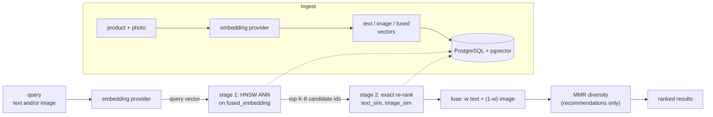
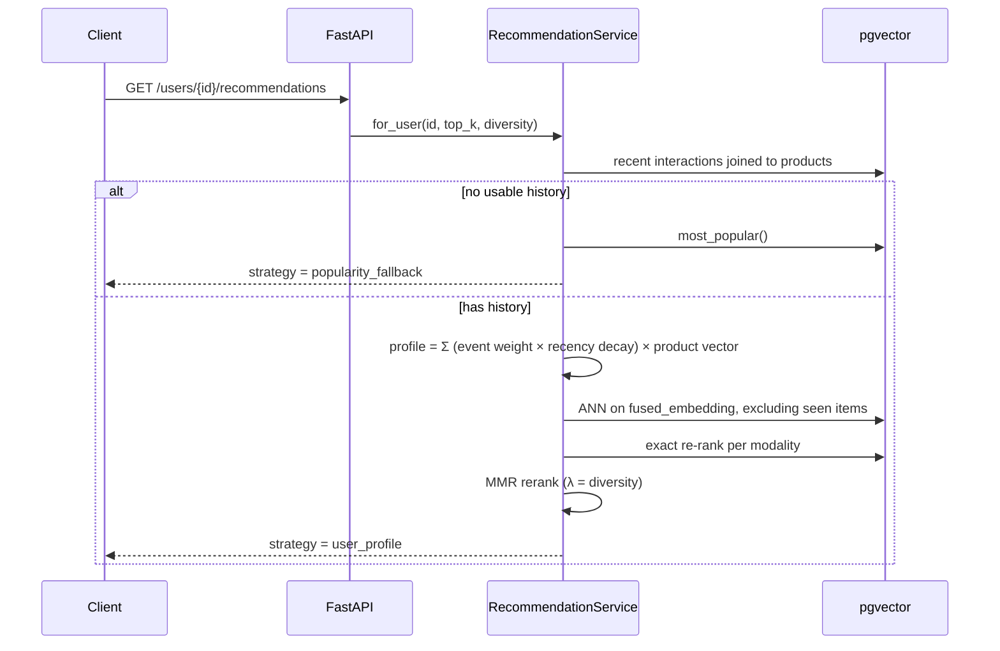

# Multimodal Product Recommender

A FastAPI product search and recommendation service where **text and product photos live in
the same vector space**. You can search the catalogue with a sentence, with an image, or with
both blended together, and get personalised recommendations from user behaviour — all backed
by PostgreSQL + `pgvector`.

No embedding model is downloaded or run locally. Embeddings come either from a hosted API
(Jina v4 or Cohere embed-v4, both with free tiers) or from a built-in offline stand-in that
needs no API key at all.

---

## The core idea

Every product carries **three vectors**:

| Column | Built from | Purpose |
|---|---|---|
| `text_embedding` | name + category + brand + description + attributes | semantic text matching |
| `image_embedding` | the product photo (`NULL` if it has none) | visual matching |
| `fused_embedding` | `normalize(w·text + (1-w)·image)` | the column the ANN index rides on |

Queries take the same shape. A text query, an image query, or a weighted blend of both becomes
one vector, and retrieval happens in two stages:

1. **ANN** over `fused_embedding` (HNSW, cosine) pulls a cheap candidate pool.
2. **Exact re-rank** recomputes similarity against `text_embedding` and `image_embedding`
   separately, then fuses them using *the caller's own* `text_weight`.

Keeping the components alongside the fusion is what makes the weight a runtime knob instead of
an index-build decision. One index serves every weighting.



---

## Stack & ports

| Piece | Choice | Port |
|---|---|---|
| API | FastAPI + Uvicorn, Pydantic v2 | **8800** |
| Database | PostgreSQL 17 + `pgvector` (HNSW, cosine) | **5439** |
| ORM / migrations | SQLAlchemy 2 (async, psycopg 3) + Alembic | — |
| Embeddings | Jina v4 / Cohere embed-v4 / offline stand-in | — |
| Demo UI | single static page served by the API | `/` |

Ports are deliberately non-default so this stack coexists with other local Compose projects.

---

## Running it

```bash
docker compose up -d
```

```bash
uv venv && uv pip install -e ".[dev]"
```

```bash
cp .env.example .env && uv run alembic upgrade head
```

```bash
uv run python -m scripts.seed --reset
```

```bash
uv run uvicorn app.main:app --reload --port 8800
```

Then open <http://localhost:8800> for the demo UI, or <http://localhost:8800/docs> for the
OpenAPI explorer.

Two operational commands: `uv run recsys info` prints the active configuration and catalogue
size; `uv run recsys reindex` re-embeds every product with the current provider.

The seeder loads 28 products across 8 categories and draws their images procedurally with
Pillow, so the whole thing works offline. To use real photos instead, drop files named after
the SKU (`SNK-001.jpg`, …) into `data/images/seed/` before seeding.

---

## Choosing an embedding provider

Set `EMBEDDING_PROVIDER` in `.env`. This is the one decision that changes what the system can
actually do.

| Provider | Cross-modal? | Cost | Notes |
|---|---|---|---|
| `local_hash` *(default)* | **No** | free, offline | Feature-hashed text + colour/edge image histograms. No API key, no model download. |
| `jina` | **Yes** | free tier | `jina-embeddings-v4`, 1–2048 dims via Matryoshka truncation. Needs `JINA_API_KEY`. |
| `cohere` | **Yes** | trial tier | `embed-v4.0`, dims 256/512/1024/1536. Needs `COHERE_API_KEY`. |

### What "cross-modal" actually means here

Only a real multimodal model puts a sentence and a photograph in the *same* space. That is what
lets "a red running shoe" match a **picture** of a red running shoe with no shared keywords.

The `local_hash` provider does **not** do that, and the system does not pretend otherwise:

- `supports_cross_modal` is `False`, and every search response carries a `cross_modal` field.
- Text queries are compared only against `text_embedding`, image queries only against
  `image_embedding` — mixing them would pour unrelated noise into the candidate pool.
- The demo UI shows a banner and the API logs a warning at startup.

What still works offline, genuinely: **text → text** search, and **image → image** search
(colour/layout similarity — real reverse-image-search behaviour). Only text ↔ image is off.

To get true multimodal retrieval, set a key and switch provider — no other code changes:

```bash
EMBEDDING_PROVIDER=jina
JINA_API_KEY=your_key_here
EMBEDDING_DIM=512
```

Then re-embed the catalogue, because vectors from different providers are not comparable and a
half-migrated table returns quietly wrong results:

```bash
uv run recsys reindex
```

If you also changed `EMBEDDING_DIM`, the column width changed too — run
`uv run alembic downgrade base && uv run alembic upgrade head` and re-seed instead.

---

## API

| Method | Path | What it does |
|---|---|---|
| `POST` | `/api/v1/products` | Create a product (multipart, optional photo) and embed it |
| `GET` | `/api/v1/products` | List with category/brand/price filters |
| `GET` | `/api/v1/products/{id}` | Fetch one |
| `PUT` | `/api/v1/products/{id}/image` | Attach/replace a photo, re-embed |
| `DELETE` | `/api/v1/products/{id}` | Remove product and its image |
| `POST` | `/api/v1/search/text` | Semantic text search |
| `POST` | `/api/v1/search/image` | Reverse image search |
| `POST` | `/api/v1/search/multimodal` | Text + image blended by `text_weight` |
| `GET` | `/api/v1/products/{id}/similar` | "More like this" |
| `POST` | `/api/v1/interactions` | Record view/click/like/cart/purchase |
| `GET` | `/api/v1/users/{id}/recommendations` | Personalised feed |
| `GET` | `/health`, `/health/ready` | Liveness; readiness incl. pgvector + provider |

### Examples

```bash
curl -s localhost:8800/api/v1/search/text -H 'content-type: application/json' \
  -d '{"query":"warm waterproof jacket for winter hiking","top_k":5}'
```

```bash
curl -s -F image=@photo.jpg "localhost:8800/api/v1/search/image?top_k=5"
```

```bash
curl -s -F image=@shoe.jpg -F query="but in red" \
  "localhost:8800/api/v1/search/multimodal?top_k=5&text_weight=0.35"
```

```bash
curl -s "localhost:8800/api/v1/users/demo-outdoors/recommendations?top_k=10&diversity=0.7"
```

### The `text_weight` knob

Same seed product, three weightings — this is the whole point of storing the components
separately (real output from the seeded catalogue, seed = *Alpine Down Puffer Jacket*):

| `text_weight` | Top results |
|---|---|
| `1.0` (text only) | Heritage Waxed Cotton Jacket, Featherlight Windbreaker, Harbour Rain Shell |
| `0.6` (default) | Commuter Laptop Backpack, Heritage Waxed Cotton Jacket, Pulse Smart Fitness Watch |
| `0.0` (image only) | Mesh Ergonomic Desk Chair, Pulse Smart Fitness Watch, Commuter Laptop Backpack |

At `0.0` the results are everything else in *midnight* — visual similarity, exactly as asked.

---

## How recommendations work

Both recommendation paths end in the same retrieve → re-rank → diversify pipeline; only the
query vector differs.



- **Event weights** — purchase 4.0, cart 3.0, like 2.0, click 1.0, view 0.5.
- **Recency decay** — exponential, 14-day half-life. A fresh view can outweigh a stale purchase.
- **Already-seen items are excluded** — no recommending back what someone just bought.
- **MMR diversity** (`diversity` = λ): `λ·relevance − (1−λ)·max similarity to already-picked`.
  `1.0` is pure relevance; lower values stop the feed collapsing into five near-identical items.
- **Cold start** falls back to popularity, and says so in the `strategy` field.

---

## Layout

```text
app/
├── api/v1/       # HTTP only: parse, call a service, serialise
├── core/         # config, logging, db session, domain errors
├── embeddings/   # provider interface + jina / cohere / local_hash
├── models/       # SQLAlchemy (products with 3 vector columns, interactions)
├── repositories/ # data access — all vector SQL lives here
├── schemas/      # Pydantic request/response
└── services/     # the rules: catalog, search, recommendation, ranking
migrations/       # Alembic; vector width comes from EMBEDDING_DIM
scripts/          # catalogue data, procedural images, seeder
static/           # single-page demo UI
tests/            # unit (pure) + integration (real Postgres, rolled back)
```

Layering is one-directional: `api → services → repositories → db`.

---

## Development

```bash
uv run pytest -q
```

```bash
uv run ruff format . && uv run ruff check --fix . && uv run mypy app
```

Unit tests are pure and fast (ranking maths, the offline provider, and the hosted clients driven
through a mock transport so a wrong API field name fails locally rather than against a real
quota). Integration tests hit a real Postgres; each runs inside a transaction that is rolled
back, so a test run leaves the seeded catalogue untouched. Tests skip cleanly if Postgres is
not up.

---

## Gotchas worth knowing

- **`EMBEDDING_DIM` is baked into the schema.** `pgvector` columns are fixed width, and the
  migration reads the setting at run time. Changing it means `alembic downgrade base`,
  `upgrade head`, and a re-seed.
- **Vectors from different providers are not comparable.** Switching provider invalidates every
  stored vector — always re-seed.
- **`event` is a reserved key in structlog.** `log.info("...", event=x)` raises `TypeError:
  got multiple values for argument 'event'`. The interaction service uses `event_type`.
- **Don't name a repository method `list`.** Inside the class body it shadows the builtin, so a
  later `-> list[uuid.UUID]` annotation dies with `'function' object is not subscriptable`.
  Hence `list_products`.
- **Products without a photo are scored on text alone**, not penalised toward zero — otherwise
  items awaiting photography could never rank.
- **Image features are mean-centred on purpose.** Raw per-cell colour means put every catalogue
  image above 0.94 cosine of every other, because product shots are mostly identical backdrop.
  Centring on the image's own mean throws that shared component away. There is a regression
  test pinning this.
- **The demo images are drawn, not photographed**, so image similarity is colour-dominant. A
  crimson sneaker's nearest visual neighbour is a crimson mug. That is correct behaviour for a
  colour/edge histogram — real photos plus a hosted provider give semantic visual similarity.
